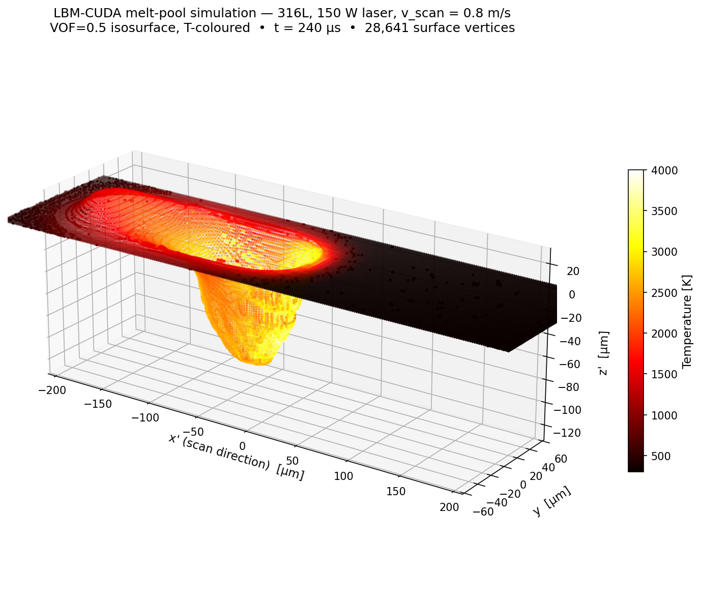
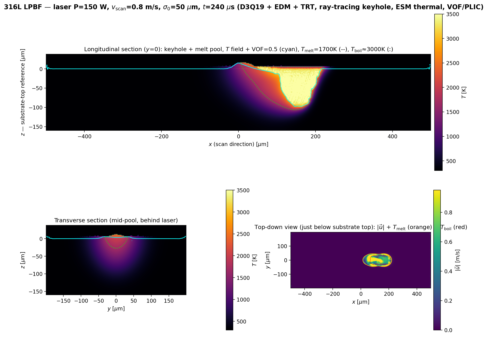
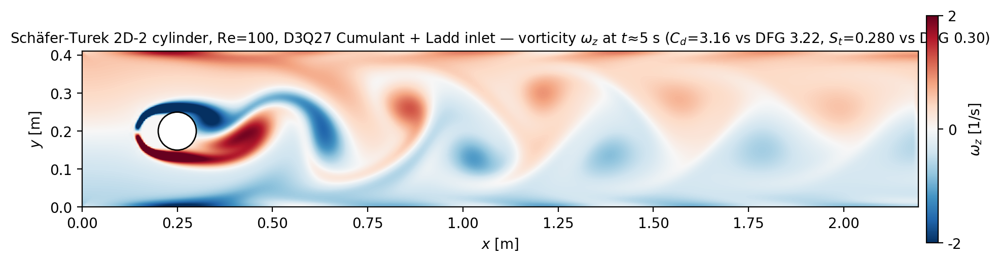
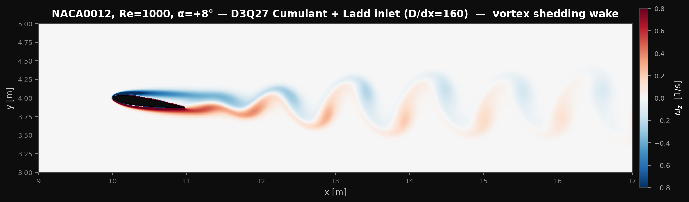
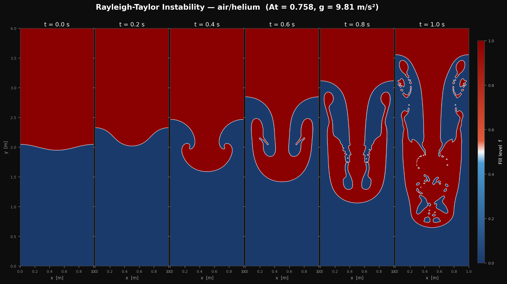
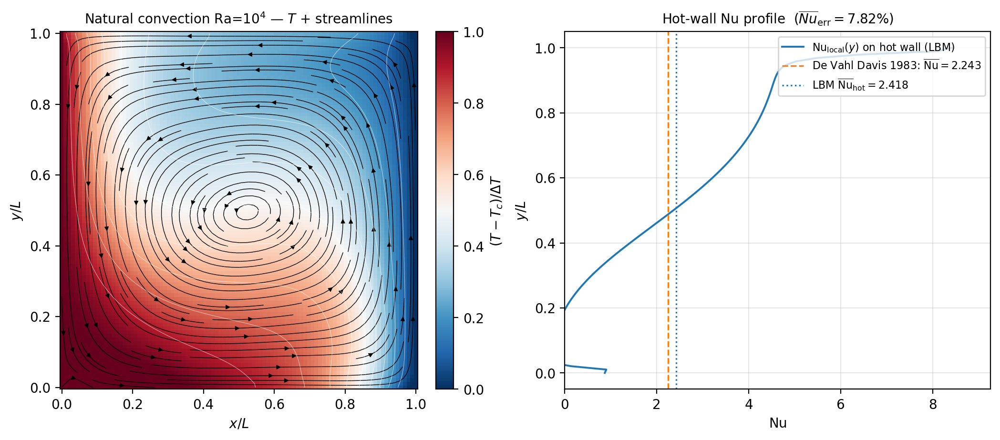

# LBM-CUDA — 模块化 GPU 格子玻尔兹曼平台

**面向金属增材制造的多物理仿真，扩展至可压缩气动学。**
单 GPU CUDA C++17、~30 k 行、L0→L5 五层架构。物理模块（流体 / 热 / 相变 / VOF /
激光 / 蒸发 / 表面张力）独立可插拔，每个模块均以经典解析解或公开 benchmark 通过
为完工标准。LPBF 算例集成 Born-Wolf 复折射率 16-bounce 光线追踪复现 keyhole 模式；
可压缩分支以 D3Q27 Cumulant 通过 Schäfer-Turek 2D-2
（$C_d=3.156$ vs DFG $[3.22, 3.24]$, $-2.3\%$）。

> *A modular single-GPU lattice-Boltzmann platform for additive-manufacturing
> simulation, extended to compressible aerodynamics. Every physics module is
> gated on a classical benchmark; limitations (single-GPU, no AMR, no
> multi-layer) are documented up-front rather than concealed.*

---

## 一图速览 | Gallery

<table>
<tr>
<td align="center" width="33%">
<br>
<sub><b>LPBF 熔池 3D 等值面</b><br>316L · 150 W · 0.8 m/s · t = 240 μs</sub>
</td>
<td align="center" width="33%">
<br>
<sub><b>纵 / 横 / 俯视三向剖面</b><br>dx = 2 μm · Born-Wolf Fresnel 光追</sub>
</td>
<td align="center" width="33%">
<br>
<sub><b>Schäfer-Turek 2D-2 涡量场</b><br>Re = 100 · D3Q27 Cumulant · $C_d$=3.16</sub>
</td>
</tr>
<tr>
<td align="center"><br><sub><b>NACA0012 α=+8° Re=1000 涡量场</b><br>D3Q27 Cumulant · D/dx=160 · von Karman 涡街</sub></td>
<td align="center"><br><sub><b>Rayleigh-Taylor 不稳定（air/helium）</b><br>At = 0.758 · PLIC + 2-phase ν · 细长拖尾 + 蘑菇双角</sub></td>
<td align="center"><br><sub><b>Lid-Driven Cavity Re=1000</b><br>vs Ghia 1982（17 点）</sub></td>
</tr>
<tr>
<td align="center"><br><sub><b>Taylor-Green 涡衰减</b><br>$E(t)/E_0$ vs $\exp(-4\nu k^2 t)$</sub></td>
<td align="center"><br><sub><b>自然对流 Ra=10⁴</b><br>vs de Vahl Davis 1983</sub></td>
<td></td>
</tr>
</table>

---

## What this is

- **A single-GPU LBM solver** that runs LPBF melt-pool simulation end-to-end —
  D3Q19 流体 + D3Q7 焓法热扩散 + VOF/PLIC 自由界面 + 16-bounce DDA 光线追踪激光
  + Anisimov 反冲压 + Hertz-Knudsen 蒸发 + Marangoni / CSF 表面张力。
- **A validation-driven codebase** — 6 个经典 benchmark + 1 LPBF 工业算例 +
  1 DFG 气动算例，全部带数值对照表，源码与脚本可一键复现。
- **A modular architecture experiment** — 物理模块各自独立、通过最小标量场接口
  耦合；每个模块以对应解析解或 benchmark 通过为完工标准（积木式 / brick-by-brick
  自底向上验证）。

---

## Validation track record

| 案例 | 关键指标 | 参考 | 偏差 | 状态 |
|---|---|---|---|---|
| Lid-Driven Cavity Re=1000 | $u(y)$, $v(x)$ 中线 $L_2$ | Ghia 1982（17 点）| **0.40 %, 0.91 %** | PASS |
| Taylor-Green 2D 涡 | 动能衰减率 | $\exp(-4\nu k^2 t)$ | **0.011 %** | PASS |
| Rayleigh-Taylor At=0.33 | 增长率 $\gamma_{\rm fit}/\gamma_{\rm th}$ | 线性理论 | 0.71（深度非线性区）| PASS [0.3, 0.9] |
| Natural Convection Ra=10⁴ | $\overline{Nu}_{\rm hot}$ | De Vahl Davis 1983 (2.243) | **+7.82 %** | PASS（< 10 % 公允区间）|
| Stefan 相变 | 界面位置 $x_f(t)$ | 解析解 | **1.15 %** @ t = 2 ms | PASS |
| Schäfer-Turek 2D-2 | $C_d$, $S_t$ | DFG benchmark | $C_d$ −2.3 %, $S_t$ −6.7 % | PASS（含 stair-step BC 偏置） |
| LPBF 316L 150 W | $T_{\max}$, 熔池 $L\!\times\! W\!\times\! D$ | Flow3D 工业基线 | 见 [子页](showcase/lpbf/) | DEMO |

每行对应 [`showcase/`](showcase/) 下的一个可复现子页；偏差均为绝对量，未做有利取舍。

---

## Physics modules

| 模块 | 方法 |
|---|---|
| 流体 | D3Q19 BGK / TRT；可调用 D3Q27 Cumulant；EDM 力项；Guo 速度修正 |
| 热 | D3Q7 + 焓法源项（ESM bisection）；apparent-Cp 自洽相变 |
| VOF | 算法版 + PLIC 几何重构；TVD/MC 限制器；面平均法向 |
| 激光 | Beer-Lambert 列推 + 16-bounce DDA 光追；Born-Wolf 复折射率 $(n+ik)$ Fresnel |
| 蒸发 | Hertz-Knudsen 质量/能量汇；Anisimov-Knight Knudsen 层反冲压 |
| 表面张力 | CSF 模型；Marangoni 切向应力 BC；HF 几何曲率 |
| 相变 | enthalpy-bisection 反演（残差 1.15 %）；Stefan 数自适应 mushy zone |

---

## Architecture

5 层、零循环依赖：

```
L0  CUDA primitives  (CudaBuffer<T>, error check, RAII)
 └→ L1  Lattice (D3Q19/D3Q7) / Collision / Streaming / Boundary
     └→ L2  叶子模块  FluidLBM, ThermalLBM, VOFSolver, PhaseChange, Laser
         └→ L3  Force pipeline (ForceAccumulator)
             └→ L4  MultiphysicsSolver (耦合调度)
                 └→ L5  I/O & VTK & FieldRegistry
```

- **SoA 布局** `f[q · num_cells + cell_idx]` — GPU warp 内合并访存
- **CUDA 分离编译** (`-rdc=true`) — 物理模块独立 .cu 文件可单独 link
- **设备常量** 全部 `__device__` 而非 `__constant__`（`-rdc=true` 下 cudaMemcpyToSymbol
  失效，已查明并修复）

详细架构白皮书见 [`docs/architecture_whitepaper.md`](docs/architecture_whitepaper.md)。

**已声明的 gap**（不假装是优势）：
单 GPU only · 无 AMR · 无多层熔覆工作流 · LPBF 熔池长度仍存在 ~50 % 系统偏差，
归因为 dx 量化 + stair-step BC + BC 阶次组合（详见 LPBF 子页）。

---

## Showcase pages

- **[showcase/lpbf/](showcase/lpbf/)** — 316L 激光熔池 (3D 等值面 + 三向剖面)
- **[showcase/cylinder/](showcase/cylinder/)** — Schäfer-Turek 2D-2 (涡量、速度、Strouhal FFT)
- **[showcase/benchmarks/lid_driven/](showcase/benchmarks/lid_driven/)** — Re = 1000 vs Ghia 1982
- **[showcase/benchmarks/rayleigh_taylor/](showcase/benchmarks/rayleigh_taylor/)** — VOF/PLIC 演化
- **[showcase/benchmarks/taylor_green/](showcase/benchmarks/taylor_green/)** — 涡衰减
- **[showcase/benchmarks/natural_convection/](showcase/benchmarks/natural_convection/)** — Ra=10⁴

---

## Build & quickstart

```bash
mkdir build && cd build
cmake .. -DCMAKE_BUILD_TYPE=Release          # 默认 sm_75/80/86，可 -DCMAKE_CUDA_ARCHITECTURES=89 自定义
make -j benchmark_keyhole_316L

./benchmark_keyhole_316L --output ../showcase/lpbf/output/
python3 ../showcase/lpbf/extract_sections.py \
    ../showcase/lpbf/output/snap_003000.vtk \
    ../showcase/lpbf/melt_pool_sections_data.npz
python3 ../showcase/lpbf/render_sections.py \
    ../showcase/lpbf/melt_pool_sections_data.npz \
    ../showcase/lpbf/melt_pool_sections.png
```

依赖：CUDA 11+（推荐 12.x）、CMake 3.18+、Python 3 (numpy / matplotlib / pyvista
仅用于后处理).

---

**作者**　余子坤　·　CFD / LBM / CUDA　·　[GitHub @yzkhere0129](https://github.com/yzkhere0129)
