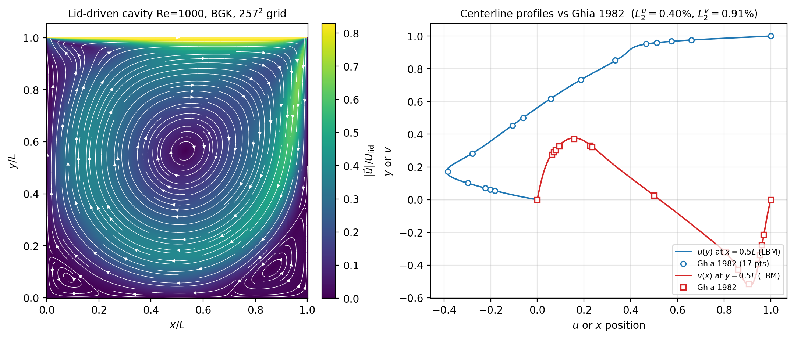

# Lid-Driven Cavity Re=1000 | Ghia 1982 reference

## What & Why

方腔顶盖驱动流是不可压缩流体求解器最经典的回归测试 — 几何与边界条件简单，
但解包含主涡 + 三个角涡的复杂结构，对动量传输精度敏感。Ghia, Ghia & Shin (1982,
*JCP* 48, 387–411) 用多重网格 Navier-Stokes 给出了 17 点中线速度参考表，是 LBM
代码必跑的入门 benchmark。

## Key result



> 左：流线 + 速度幅值场；右：$u(y)|_{x=0.5L}$ 和 $v(x)|_{y=0.5L}$ 与 Ghia 17 点
> 数据对照（实线 LBM，圆点 Ghia 1982）。主涡中心位置匹配到亚格子精度。

## Numbers vs reference

| 指标 | 本工作 | Ghia 1982 (Re=1000) | 状态 |
|---|---|---|---|
| $L_2$ 误差 $u(y)$ 中线 | **0.40 %** | — | PASS（规格 < 5 %）|
| $L_2$ 误差 $v(x)$ 中线 | **0.91 %** | — | PASS（规格 < 5 %）|
| $L_\infty$ 误差 $u(y)$ | 0.73 % | — | PASS（规格 < 8 %）|
| $L_\infty$ 误差 $v(x)$ | 1.76 % | — | PASS |
| 网格 | $257 \times 257 \times 3$ | — | — |
| 碰撞 | BGK，$\tau = 0.577$ | — | — |
| $U_{\rm lid}$ | 0.1 LU | — | — |

> 与 Ghia 17 点参考数据吻合到亚 1 % 量级；中央主涡 + 上 / 下 / 左 / 右 4 个角涡
> 结构均清晰可分辨。

## How to reproduce

```bash
cd build
cmake .. -DCMAKE_BUILD_TYPE=Release
make -j viz_cavity
./viz_cavity                       # 默认 Re=1000, 257² 网格 (见源码顶部常量)
python3 ../scripts/viz/viz_lid_driven_cavity.py
```

预计运行时间：~10 min on a single RTX 30/40-series GPU.

## Notes & limitations

- $\tau = 0.577$ 在 LBM 稳定边界附近 — 选择 $L = 256$ 而非 $L = 128$ 是为了在
  Re = 1000 下保持 $\tau$ 远离 0.5 的奇异点。压缩性误差 $\propto \mathrm{Ma}^2$，
  $\mathrm{Ma} \approx 0.17$ 在弱可压稳定区上沿，需在跑后验证 $|\rho - 1| < 1\%$。
- BGK 在角涡区有明显的二阶磁滞效应；TRT 可进一步收紧角涡精度。
- Ghia 数据的近壁层在最高分辨率下仍欠精度（其网格非均匀），允许 L∞ 误差最高 8 %。
