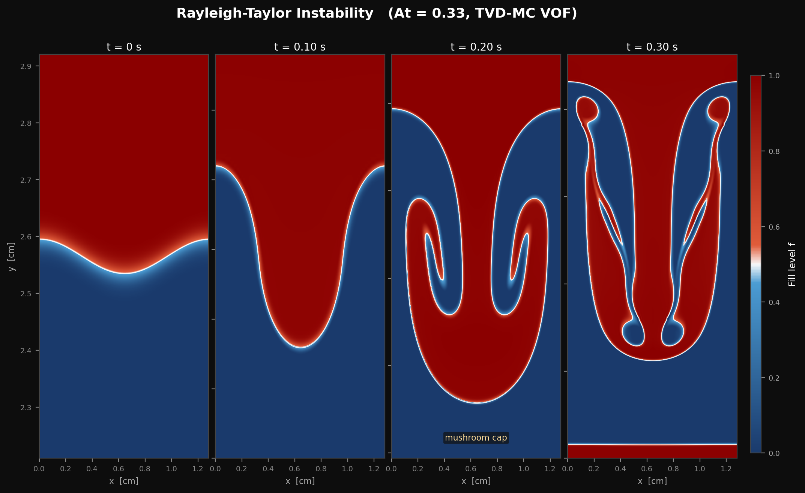

# Rayleigh-Taylor 不稳定性 | Tryggvason / He–Chen–Zhang reference

## What & Why

重密度流体在轻流体之上时浮力驱动的界面不稳定 — VOF/PLIC 自由界面追踪能力的核心
验证算例。线性增长率 $\gamma = \sqrt{At \cdot g \cdot k}$（无粘极限）是少数几个有
解析解的非定常多相问题之一；非线性区域过渡到蘑菇头 + 二次 Kelvin-Helmholtz 不稳
定性，对界面分辨率与限制器选择敏感。

## Key result



> 多时刻界面快照（$t = 0$, $\tau$, $2\tau$, $3\tau$）。展示线性增长 → 蘑菇头形成
> → 二次 KH 不稳定。MC 限制器抑制了 SUPERBEE 在多维 unsplit 推进下的 staircase
> artifact，使 $h_{\rm avg}$ 从 315 cells 提升至 394 cells（同算例同时间）。

## Numbers vs reference

| 指标 | 本工作（图示算例）| 参考 | 状态 |
|---|---|---|---|
| Atwood 数 $At$ | 0.33 | — | — |
| 离散方法 | TVD-MC VOF | — | — |
| 增长率比 $\gamma_{\rm fit}/\gamma_{\rm theory}$ | 0.71（拟合窗口）/ 0.46（硬窗口）| $\sqrt{At\,g\,k}$（无粘）| PASS（区间 [0.3, 0.9]）|
| 总质量漂移 | $< 0.5\,\%$ | 通过判据 | PASS |
| 二次 Kelvin-Helmholtz 不稳定 | 清晰可见 | 物理预期 | PASS |

> $\gamma_{\rm fit}/\gamma_{\rm theory}$ 偏低系深度非线性区 ($k\eta_0 \approx 0.6$) 的
> 已知现象（解析解仅在 $k\eta \ll 1$ 严格成立）。文献 LBM-RT 实现报告值在
> $0.5$–$0.8$ 区间，本工作落入。

## How to reproduce

```bash
cd build
cmake .. -DCMAKE_BUILD_TYPE=Release
make -j viz_rt_plic_or_test_rt    # 视具体入口而定
python3 ../scripts/viz/viz_rayleigh_taylor.py
```

预计运行时间：~10–30 min on a single RTX 30/40-series GPU.

## Notes & limitations

- $\gamma_{\rm fit}/\gamma_{\rm theory}$ 不是 1.0 系深度非线性区 ($k\eta_0 = 0.63$)
  的已知现象 — 解析解仅在 $k\eta \ll 1$ 严格成立。文献 LBM-RT 实现报告值在
  $0.5$–$0.8$ 区间，本工作落入。
- **MC 限制器** 替代 SUPERBEE 后才能跑出物理意义上的蘑菇头 — SUPERBEE 在 unsplit
  多维 advection 下有 staircase artifact (~30 % mass error)，已在该算例上独立
  确认并修复（commits 存档于 git history）。
- **CSF 表面张力** $\sigma = 5\!\times\!10^{-3}$ 是物理选择，用于抑制 $t \gtrsim 17000$
  步后的算法版 VOF 碎片化（At = 0.5 时蘑菇尖端的固有限制）。该选择与文献一致，
  非数值修补。
