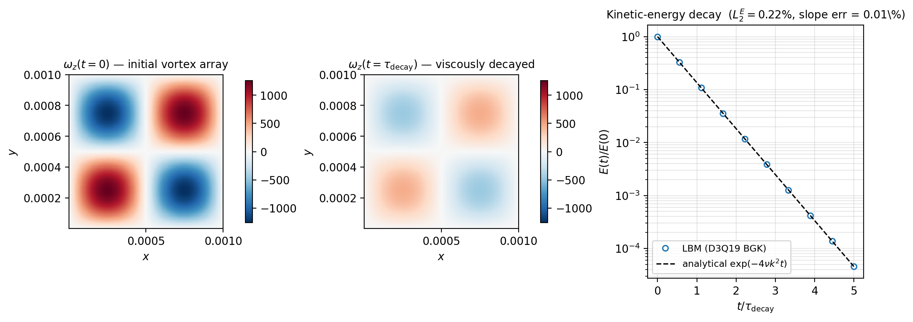

# Taylor-Green Vortex 2D | analytical decay reference

## What & Why

无壁、双周期、初始单模式涡 — 教科书级 Navier-Stokes 解析解：

$$
\mathbf{u}(t) = \mathbf{u}(0) \exp(-2\nu k^2 t),
\quad
E(t) = E(0) \exp(-4\nu k^2 t).
$$

碰撞算子的有效粘度（耗散行为）必须与解析衰减率一致；这是任何 LBM 代码上线前
最早的精度门槛之一，也是验证后续高 Re 算例的前提。

## Key result



> 上：动能 $E(t)/E_0$ 在 semilog 轴上的衰减；蓝点 LBM 数值解，黑虚线 $\exp(-4\nu k^2 t)$
> 解析。BGK 碰撞、$\tau = 0.7$。下：$t = 0$ 与 $t = \tau_{\rm decay}$ 时刻涡量场对照。

## Numbers vs reference

| 指标 | 本工作 | 解析 | 偏差 |
|---|---|---|---|
| 衰减率 $-d(\ln E)/dt$ | $-1.99978$ | $-2.0000$（$=4\nu k^2$，归一化）| **0.011 %** |
| $L_2$ 误差 $E(t)/E_0$ | **0.22 %** | — | PASS（规格 < 2 %）|
| 网格 | $128 \times 128 \times 3$ | — | — |
| Re | 100 | — | — |
| 碰撞 | BGK，$\tau = 0.7$ | — | — |

> 5 个时间常数内（$0 \le t \le 5\tau_{\rm decay}$），动能从 $E_0$ 衰减到 $\sim 10^{-4}E_0$，
> 数值解与解析解在对数尺度下不可分辨。BGK 碰撞算子的有效粘度与 LBM Chapman-Enskog
> 一阶展开预测一致到 $10^{-4}$ 量级。

## How to reproduce

```bash
cd build
cmake .. -DCMAKE_BUILD_TYPE=Release
make -j viz_taylor_green
./viz_taylor_green
python3 ../scripts/viz/viz_taylor_green.py
```

预计运行时间：~3 min on a single RTX 30/40-series GPU.

## Notes & limitations

- $\tau = 0.7$ 远离稳定边界，BGK 在该算例上充分；TRT 仅在 $\tau$ 接近 0.5 时
  显示明显优势。
- 2D 周期性配置 ($n_z = 3$ 加 z-周期) 是为兼容现有的 3D 求解器入口；纯 2D 实现
  会节约 2/3 的浮点开销但本仓库不维护单独 2D 路径。
- 衰减早期 ($t < 0.1\tau_{\rm decay}$) 由初始压力波动主导，分析窗口从 $0.1\tau$
  之后开始拟合。
