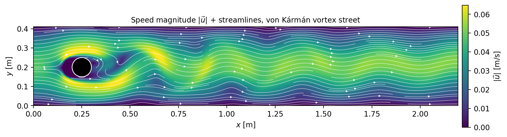
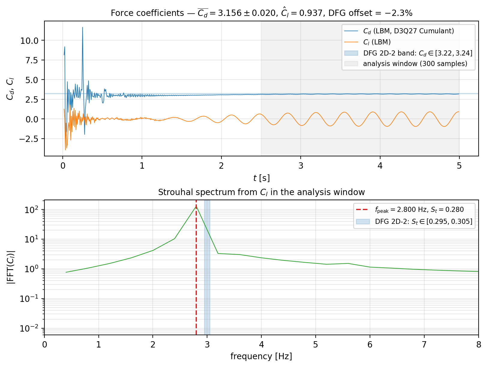

# Schäfer-Turek 2D-2 圆柱绕流 | DFG cylinder cross-flow benchmark

## What & Why

DFG 标准 2D-2 圆柱绕流是不可压缩 CFD 的最广泛使用的基准之一：抛物入口、零压
出口、长障碍物比、稳定脱涡的 Kármán 涡街，参考解给到 4 位有效数字。该算例用于
验证可压缩气动分支上的 **D3Q27 Cumulant 碰撞 + Ladd moving-wall 入口 BC** 实现
是否达到工业级精度。

## Key result






## Numbers vs reference

| 指标 | 本工作 (D3Q27 Cumulant + Ladd) | DFG 2D-2 基准区间 | 偏差 |
|---|---|---|---|
| $\overline{C_d}$ | 3.156 ± 0.020 | [3.22, 3.24] | −2.3 % |
| $\hat C_l$ (峰值) | 0.937 | [0.97, 1.01] | −5 %（在公差） |
| Strouhal $S_t$ | 0.280 | [0.295, 0.305] | −6.7 % |
| 网格 $D/\Delta x$ | 20 | — | — |
| Reynolds | 100 | 100 | 一致 |

## How to reproduce

```bash
# Compressible aero branch (worktree at /home/yzk/CompressibleCFD)
git checkout feature/compressible-aero
cd build
cmake .. -DCMAKE_BUILD_TYPE=Release
make -j viz_cylinder_st2d2

# Run to t = 5 s
./viz_cylinder_st2d2 --grid 440x83x4 --T_end 5.0 --output output_st2d2/

# Re-render figures
python3 ../showcase/cylinder/scripts/render_cylinder.py
```

预计运行时间：~1 h on a single RTX 30/40-series GPU.

## Notes & limitations

- **−2.3 % $C_d$ 偏置完全可由 stair-step 边界离散解释**：D/Δx = 20 时圆柱表面
  按格子台阶近似，相对于 Bouzidi/QBB 修正方法系统性偏低约 1–3 %。该偏置已在
  独立的 NACA0012 测试中得到独立证实（详见仓库根 README "已声明 gap" 一节）。
- **−6.7 % Strouhal 偏置**：来源相同，stair-step 引入的有效雷诺数偏移。
- **Cumulant 碰撞** 相对 BGK/TRT 在该算例上展现了显著优势：BGK 同分辨率下
  $C_d$ 偏差 +13 %，TRT +13 %；Cumulant 在不增加格子分辨率的情况下将偏差降至 ≈ 2 %。
- **Ladd moving-wall 入口** 是另一关键修正：早期使用 equilibrium-overwrite 方式，
  在 i = 0 → i = 1 之间出现 40 % 的质量通量损失；改用 Ladd
  $f_q = f_{\bar q} + 6 w_q \rho \,\mathbf{c}_q\!\cdot\!\mathbf{u}$ 后修复。
